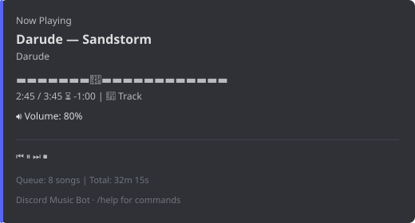

<p align="center">
  
</p>

<h1 align="center">🎵 Discord Music Bot</h1>

<p align="center">
  A feature-rich Discord music bot written in Java.<br/>
  Supports <b>YouTube</b>, <b>SoundCloud</b>, <b>Spotify</b> &amp; Internet Radio.<br/>
  Slash commands, queue management, audio filters, nonstop mode, and more.
</p>

<p align="center">
  <a href="../../actions/workflows/release.yml"></a>
  <a href="LICENSE"></a>
  <a href="../../releases/latest"></a>
  
  <a href="https://discord.gg/9vMARH8hnV"></a>
  
</p>

<p align="center">
  <a href="#-features">Features</a> •
  <a href="#-commands">Commands</a> •
  <a href="#-installation">Installation</a> •
  <a href="#-configuration">Configuration</a> •
  <a href="#-support">Support</a>
</p>

---

<p align="center">
  
  <br/>
  <em>Now Playing embed with progress bar, volume, repeat mode &amp; media controls (<code>/playing</code>)</em>
</p>

---

## ✨ Features

| Category | Details |
|----------|---------|
| 🎶 **Multi-Source** | YouTube, SoundCloud, Spotify (tracks, albums, playlists) & 20+ Internet radio stations |
| 📋 **Queue Management** | Add, remove, move, skip-to, shuffle, clear, repeat (off/track/queue) |
| 🎚️ **Audio Filters** | Bass boost, treble, pop, rock – built-in equalizer presets |
| 🔁 **Nonstop Mode** | Auto-queue with configurable genres – endless Tekk, Techno, Uptempo & more |
| 📂 **Playlist System** | Per-user, per-guild playlists – create, add, remove, delete & play via `/playlist` |
| 🌍 **i18n** | Deutsch, English, Français, Español, Italiano – per-server language via `/language` |
| 🎮 **Full Slash Commands** | All features accessible via Discord's native slash command system |
| 🔐 **DAVE E2EE** | Full Discord DAVE protocol support (required since March 2026) |
| 🖥️ **Cross-Platform** | Windows (`start.bat`), Linux (`start.sh`), macOS, systemd service |

---

## 🎮 Commands

| Command | Description |
|---------|-------------|
| `/play <url/search>` | Play a track (YouTube / SoundCloud / Spotify / text search) |
| `/skip` | Skip the current track |
| `/stop` | Stop music & clear the queue |
| `/pause` / `/resume` | Pause / resume playback |
| `/queue` | Show the queue with pagination |
| `/playing` | Now-playing view with progress bar & media controls |
| `/volume <0-100>` | Set volume |
| `/join` / `/leave` | Join / leave voice channel |
| `/repeat <off\|track\|queue>` | Set repeat mode |
| `/shuffle` | Shuffle the queue |
| `/radio <station>` | Play an internet radio station |
| `/seek <time>` | Seek within the current track (e.g. `1:30`) |
| `/remove <pos>` | Remove a track from the queue |
| `/clear` | Clear the queue (current track continues) |
| `/move <from> <to>` | Move a track in the queue |
| `/skipto <pos>` | Jump to a specific position in the queue |
| `/save` | Save the current track via DM |
| `/nonstop [auto-on\|auto-off]` | Toggle nonstop auto-queue mode |
| `/filter <preset>` | Apply audio filter / equalizer preset |
| `/language [code]` | Change bot language per server (`de`, `en`, `fr`, `es`, `it`) |
| `/playlist` | Create / manage / play playlists (`create`, `add`, `remove`, `delete`, `view`, `play`) |
| `/invite` | Get bot invite link |
| `/help` / `/info` / `/uptime` / `/ping` | Bot information & status |
| `/dcleave <server>` | Force-leave a server (bot owner only) |

---

## 🚀 Installation

### Prerequisites
- **Java 26+** ([Temurin](https://adoptium.net/) or [OpenJDK](https://jdk.java.net/26/))
- **Linux:** `opus`, `libsodium`, `ffmpeg` (handled by `install.sh`)
- **Windows:** Java only – Opus/Sodium natives are bundled in the JAR

---

### 🪟 Windows

#### 1. Install Java 26
```powershell
winget install EclipseAdoptium.Temurin.26.JDK
java -version  # verify
```

#### 2a. Download prebuilt JAR (easiest)
1. Download the `.jar` from the [latest release](../../releases/latest)
2. Download `config.properties.example` → rename to `config.properties` → fill in your bot token
3. Place both files in the **same folder** and double-click `start.bat` – or run:
   ```powershell
java --enable-native-access=ALL-UNNAMED -Xmx2G -jar discord-music-bot-2.4-all.jar
   ```

#### 2b. Build from source
```powershell
git clone https://github.com/GamerNico2002/discord-music-bot.git
cd discord-music-bot
copy config.properties.example config.properties
notepad config.properties   # set bot.token
.\gradlew.bat shadowJar
.\start.bat
```

---

### 🐧 Linux

#### Option A – Download prebuilt JAR
```bash
wget https://github.com/GamerNico2002/discord-music-bot/releases/latest/download/discord-music-bot-2.4-all.jar
wget https://raw.githubusercontent.com/GamerNico2002/discord-music-bot/main/config.properties.example -O config.properties
nano config.properties
java --enable-native-access=ALL-UNNAMED -Xmx2G -jar discord-music-bot-2.4-all.jar
```

#### Option B – Build from source
```bash
git clone https://github.com/GamerNico2002/discord-music-bot.git
cd discord-music-bot
cp config.properties.example config.properties
nano config.properties
./gradlew shadowJar
./start.sh
```

#### Option C – One-click setup (Debian/Ubuntu/Fedora/Arch)
```bash
sudo ./install.sh   # installs Java 26 + opus/libsodium/ffmpeg
cp config.properties.example config.properties
nano config.properties
./start.sh
```

---

### 🍎 macOS
```bash
brew install --cask temurin@25
brew install opus libsodium ffmpeg
git clone https://github.com/GamerNico2002/discord-music-bot.git
cd discord-music-bot
cp config.properties.example config.properties
nano config.properties
./gradlew shadowJar
./start.sh
```

---

### 🤖 Creating a Discord Application

1. Go to https://discord.com/developers/applications → **New Application**
2. Tab **Bot** → **Reset Token** → copy and paste into `config.properties`
3. Enable **Privileged Intents**: *Message Content*, *Server Members*
4. **OAuth2 → URL Generator**
   - Scopes: `bot`, `applications.commands`
   - Permissions: *Send Messages*, *Connect*, *Speak*, *Read Message History*
5. Open the generated URL → invite the bot to your server

---

## ⚙️ Configuration

All settings in [`config.properties`](config.properties.example):

| Key | Required | Description |
|-----|----------|-------------|
| `bot.token` | ✅ | Discord bot token |
| `bot.owner` | ❌ | Owner display name (for `/info`) |
| `bot.owner.id` | ❌ | Owner Discord ID (for `/dcleave`) |
| `bot.support` | ❌ | Support text in `/info` |
| `spotify.client.id` / `spotify.client.secret` | ❌ | For Spotify track/playlist/album resolution |
| `nonstop.genres` / `nonstop.modifiers` | ❌ | Customize nonstop mode genres & search modifiers |

---

## 🛠️ systemd Service (Linux)

`/etc/systemd/system/musicbot.service`:
```ini
[Unit]
Description=Discord Music Bot
After=network.target

[Service]
Type=simple
User=musicbot
WorkingDirectory=/opt/discord-music-bot
ExecStart=/opt/jdk-26/bin/java --enable-native-access=ALL-UNNAMED -Xmx2G -jar discord-music-bot-2.4-all.jar
Restart=always
RestartSec=10

[Install]
WantedBy=multi-user.target
```

```bash
sudo systemctl daemon-reload
sudo systemctl enable --now musicbot
journalctl -u musicbot -f
```

---

## 📋 Bot Lists

Want to help others discover this bot? Add it to a Discord bot list:

- [**top.gg**](https://top.gg/) – largest Discord bot listing site
- [**discordbotlist.com**](https://discordbotlist.com/)
- [**discord.bots.gg**](https://discord.bots.gg/)
- [**discordlist.space**](https://discordlist.space/)
- [**discord.me**](https://discord.me/)

> 💡 Listing on these sites dramatically increases visibility and user adoption.

---

## 🌍 Languages (i18n)

The bot supports multiple languages for all user-facing messages.  
Language is stored **per Discord server** in `languages.properties` (persists across restarts).

| Code | Language |
|------|----------|
| `de` | 🇩🇪 Deutsch (default) |
| `en` | 🇬🇧 English |
| `fr` | 🇫🇷 Français |
| `es` | 🇪🇸 Español |
| `it` | 🇮🇹 Italiano |

`/language code:en` sets responses to English. `/language` without arguments shows the current language.

---

## 💬 Support

<p align="center">
  <a href="https://discord.gg/9vMARH8hnV">
    
  </a>
</p>

Questions? Bugs? Ideas? Join the [Discord Support Server](https://discord.gg/9vMARH8hnV).

---

## 🤝 Contributing

Pull requests are welcome! For major changes, please open an issue first or reach out on [Discord](https://discord.gg/9vMARH8hnV).

---

## 📄 License

[MIT](LICENSE) © GamerNico2002
